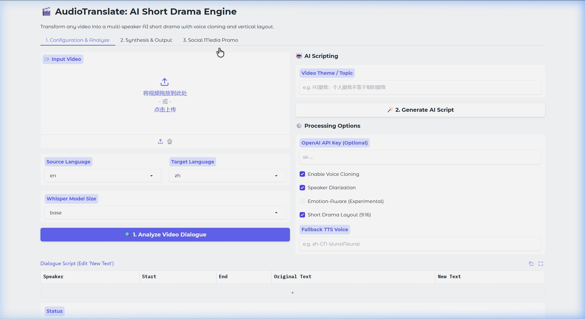

# AudioTranslate

[](LICENSE)
[](https://www.python.org/)

**AudioTranslate** is a fully local audio/video translation and automated dubbing tool. It extracts, transcribes, translates, and generates new dubbing for the human voice in a video while perfectly preserving the original background music and ambient sounds.

[简体中文](README.md) | [English](README_EN.md)

## 🌟 Core Features

- ✅ **Vocal Separation**: Uses Meta's Demucs model for high-precision separation of vocals and background noise.
- ✅ **Speaker Diarization**: Integrated ModelScope CAM++ model to automatically distinguish between different speakers.
- ✅ **Fully Localized**: Supports Faster-Whisper (transcription) and Argos Translate (translation). No internet connection required, ensuring privacy.
- ✅ **Background Preservation**: Perfectly keeps original background music, applause, and environmental sounds while replacing the dubbing.
- ✅ **Auto-Speed Alignment**: Intelligently detects the speed of translated text. If the translation is too long, it performs lossless acceleration (atempo) to ensure no overlap and natural rhythm.
- ✅ **Voice Cloning (High Quality)**: Integrated OpenVoice V2. Supports extracting the tone color of original speakers and applying it to the new dubbing.
- ✅ **AI Script Generation**: Support generating scripts based on a theme using the `--theme` parameter (maintains original pacing).
- ✅ **Human-in-the-loop Mode**: Extract dialogue to Markdown via `--analyze`, edit manually, and synthesize via `--script` for precise control.
- ✅ **Short Drama Mode**: Convert to 9:16 vertical layout with blurred background and high-visibility top subtitles.
- ✅ **Local WebUI**: **[NEW]** Provides a Gradio-based graphical interface featuring:
    - 📺 **Visual Analysis**: Real-time view of transcribed dialogue and timeline.
    - ✍️ **Interactive Editor**: Edit lines directly in a browser table—no need to touch Markdown files.
    - 🤖 **AI Refinement**: Input themes like "AI Productivity" to auto-rewrite scripts based on original context.
    - 📱 **Social Media Tools**: One-click generation of titles and hashtags for TikTok, YouTube Shorts, etc.
- ✅ **High-Quality Dubbing**: Integrated Edge-TTS, supporting various expressive male and female voices.

## 🛠️ Technical Stack

- **Speech Recognition**: Faster-Whisper
- **Diarization**: ModelScope CAM++
- **Vocal Separation**: Demucs
- **Machine Translation**: Argos Translate (Offline)
- **Speech Synthesis**: Edge-TTS & OpenVoice V2
- **Audio/Video Processing**: FFmpeg & ffmpeg-python
- **Core Framework**: Python, Click, PyTorch

## 🚀 Quick Start

### Prerequisites

- Python 3.8+
- **FFmpeg**: Must be installed and added to the system's PATH.
- **Hardware**: 8GB+ RAM recommended. NVIDIA GPU with CUDA support is highly recommended for acceleration.

### Installation

```bash
# Clone the repository
git clone https://github.com/your-username/audiotranslate.git
cd audiotranslate

# Install dependencies (Virtual environment recommended)
pip install -r requirements.txt
```

> **Note for Windows Users**:
> The default `requirements.txt` is optimized for stable PyTorch CPU compatibility on Windows. If you have an NVIDIA GPU, please install the GPU version of PyTorch manually.

### 🚀 Quick Start

#### 1. Launch WebUI (Recommended)
The most intuitive way to use the tool with visual editing.
```bash
python -m audiotranslate.main webui
```
After launching, visit `http://localhost:7860` in your browser.

#### 2. CLI Basic Usage
If you prefer the command line:
```bash
# Translate English video to Chinese (default female voice)
python -m audiotranslate.main translate input.mp4

# Advanced: Voice Cloning + Diarization + Emotion Awareness
python -m audiotranslate.main translate input.mp4 --clone --diarize --emotion
```

### 🖥️ WebUI Features



The WebUI provides powerful **Human-in-the-loop** capabilities:

1. **Processing Tab**:
    - **Step 1: Analyze Video**: Upload a video and click "Analyze Dialogue". The system extracts every line with precise timestamps and displays them in a table.
    - **Step 2: Refine Script**:
        - **Manual Edit**: Directly modify the translated lines in the `New Text` column.
        - **AI Rewrite**: Enter a theme (e.g., "More humorous" or "AI Productivity") and click "Generate AI Script". The system rewrites the dialogue based on original context.
    - **Step 3: Synthesize**: Click "Synthesize Final Video" to dub, align speed, and render the final video.
2. **Social Media Promo Tab**:
    - After synthesis, switch to this tab.
    - Enter your API Key and click generate to get viral titles, copy, and hashtags for **WeChat Video Channel, TikTok, or YouTube Shorts**.

---

### 🎬 Human-in-the-loop Workflow (CLI version)

For high-quality AI short dramas, we recommend this 3-step workflow:

1. **Analyze**: Extract the timeline to Markdown.
   ```bash
   python -m audiotranslate.main video.mp4 --analyze
   ```
2. **Edit**: Open `video_analysis.md` and fill in your new lines in the `New Text (Action)` column.
3. **Synthesize**: Generate the final video from your script.
   ```bash
   python -m audiotranslate.main video.mp4 --script video_analysis.md --clone --short_drama
   ```

## 📺 Comparisons (Case Study)

Using Jensen Huang's GTC keynote as an example:

### Original Video (English)
[Link to original video]

### Translated & Dubbed (Chinese)
[Link to dubbed video]

*Replaced with male voice (Yunxi), **background preserved**, and **auto-speed aligned**.*

## 📂 Project Structure

```text
audiotranslate/
├── audiotranslate/        # Core Logic
│   ├── main.py            # CLI Entry
│   ├── processor.py       # A/V Processing (FFmpeg)
│   ├── transcriber.py     # Speech Recognition (Whisper)
│   ├── translator.py      # Local Translation (Argos)
│   ├── generator.py       # Speech Synthesis (Edge-TTS)
│   └── emotion_analyzer.py # Emotion Analysis
├── tests/                 # Unit Tests
├── requirements.txt       # Dependencies
└── LICENSE                # MIT License
```

## 📝 Roadmap

- [x] Multi-speaker Diarization & Cloning.
- [x] Emotion-Aware Dubbing.
- [x] Graphical User Interface (WebUI).
- [ ] More local TTS engines (Piper, Kokoro-ONNX).
- [ ] Optimize resume and caching mechanisms.

## 🎭 Voice Cloning (OpenVoice V2)

This project integrates [OpenVoice V2](https://github.com/myshell-ai/OpenVoice) to extract "Tone Color" from original videos.

### Setup

1. **Clone Source**:
   ```bash
   git clone https://github.com/myshell-ai/OpenVoice.git
   ```

2. **Download Weights**:
   Download `checkpoints_v2` from [Hugging Face](https://huggingface.co/myshellai/OpenVoiceV2/tree/main) and extract to `checkpoints_v2/` in the root directory.

3. **Run**:
   Add `--clone` to your command.

## 🤝 Contributing

Contributions are welcome!
1. Fork the project.
2. Create your feature branch (`git checkout -b feature/AmazingFeature`).
3. Commit changes (`git commit -m 'Add some AmazingFeature'`).
4. Push to branch (`git push origin feature/AmazingFeature`).
5. Open a Pull Request.

## License

This project is licensed under the [MIT License](LICENSE).

---
**Disclaimer**: This tool is for educational and research purposes only. Do not use for illegal activities.
